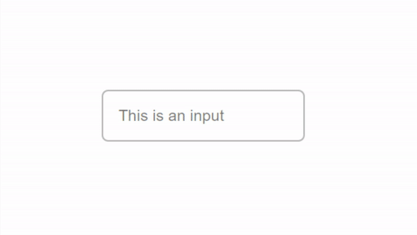

# Input
(inspired by Googles Material Design)  
demo: [git.tim-greller.de/input](https://tim-greller.de/git/input)  



## How to use
1. Include the stylesheet:
    - If you provide the file yourself: <br> ```<link rel="stylesheet" href="input.css">```
    - If you want to include the latest version automatically without downloading anything from this repository: <br> ```<link rel="stylesheet" href="https://tim-greller.de/git/input/input.css">```
2. Create an input with a custom label:
    ```
    <div class="input">
        <input type="text" required/>
        <label>This is an input</label>
    </div>
    ```
3. You can now adjust width, height, padding, border and margin of the input-div.
